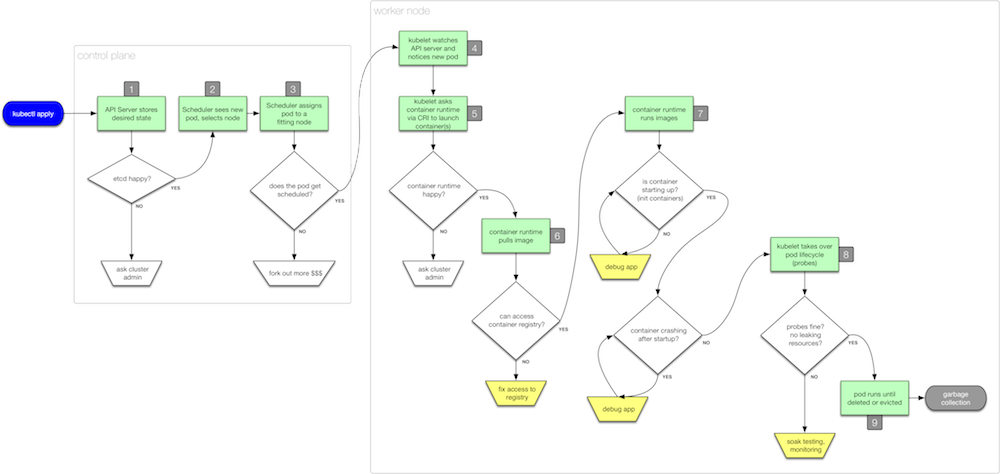

# Troubleshooting Kubernetes Applications

A talk at [Velocity NYC 2018](https://conferences.oreilly.com/velocity/vl-ny/public/schedule/detail/69892):

_When?_  &nbsp;&nbsp;&nbsp; Wednesday Oct 3, 1:30pm (40min) <br />
_Where?_ &nbsp;&nbsp; Beekman/Sutton North <br />

[Preparation](#preparation)     | [Intro](#intro)             | [Poking Pods](#poking-pods)
---                             | ---                         | ---
[Storage](#storage)             | [Network](#network)         | [Security](#security) 
[Observability](#observability) | [Vaccination](#vaccination) | [References](#references)


The slide deck is available [here](http://dev/null) and to demonstrate the different failures and how to fix them I'm using the following commands.

## Preparation

Before the talk:

```
kubectl create ns vnyc

# in different tmux pane:
watch kubectl -n vnyc get all
```

## Intro

Using [00_intro.yaml](00_intro.yaml):

```
kubectl -n vnyc apply -f 00_intro.yaml

kubectl -n vnyc describe deploy/unhappy-camper

THEPOD=$(kubectl -n vnyc get po -l=app=whatever --output=jsonpath={.items[*].metadata.name})
kubectl -n vnyc describe po/$THEPOD
kubectl -n vnyc logs $THEPOD
kubectl -n vnyc exec -it $THEPOD -- sh

kubectl -n vnyc delete deploy/unhappy-camper
```

## Poking Pods

### Image issue

```
kubectl -n vnyc apply -f 01_pp_image.yaml
kubectl -n vnyc get pods
kubectl -n vnyc get events | grep confused | grep Error
kubectl -n vnyc patch deployment confused-imager  \
                --patch '{ "spec" : { "template" : { "spec" : { "containers" : [ { "name" : "something" , "image" : "mhausenblas/simpleservice:0.5.0" } ] } } } }' \
```


- `kubectl get pods` and `get events`
- `kubectl exec` for when it crashes
- `kubectl logs` for app-level SNAFU


Download [in original resolution](https://github.com/mhausenblas/troubleshooting-k8s-apps/raw/master/img/pod-lifecycle.png).

References:

- [Debugging microservices - Squash vs. Telepresence](https://www.weave.works/blog/debugging-microservices-squash-vs-telepresence)
- [Debugging and Troubleshooting Microservices in Kubernetes with Ray Tsang (Google)](https://www.weave.works/blog/debugging-and-troubleshooting-microservices-in-kubernetes)
- [Troubleshooting Kubernetes Using Logs](https://blog.papertrailapp.com/troubleshoot-kubernetes-using-logs/)

## Storage

Show failed mount

References:

- [Debugging Kubernetes PVCs](https://itnext.io/debugging-kubernetes-pvcs-a150f5efbe95) 

## Network

- wrong selector (can't ping VIP)
- `127.0.0.1` issue
- taking a pod offline for debugging (service)

References:

- DOCS: [Debug Services](https://kubernetes.io/docs/tasks/debug-application-cluster/debug-service/)
- [Troubleshooting Kubernetes Networking Issues](https://gravitational.com/blog/troubleshooting-kubernetes-networking/)

## Security

Show missing permissions and `can-i`

References see [kubernetes-security.info](https://kubernetes-security.info/).

## Observability

Show Linkerd 2.0 in action, show Jaeger 101.

References:

- [Evolution of Monitoring and Prometheus](https://www.slideshare.net/brianbrazil/evolution-of-monitoring-and-prometheus-dublin-2018)

## Vaccination

Show chaoskube in action.

References:

- [Kubernetes: five steps to well-behaved apps](https://medium.com/@betz.mark/kubernetes-five-steps-to-well-behaved-apps-a7cbeb99471a)
- [Kubernetes Best Practices](https://medium.com/google-cloud/kubernetes-best-practices-8d5cd03446e2)
- [Developing on Kubernetes](https://kubernetes.io/blog/2018/05/01/developing-on-kubernetes/)
- [Kubernetes Application Operator Basics](https://blog.openshift.com/kubernetes-application-operator-basics/) 
- Tooling
  - [chaoskube](https://github.com/linki/chaoskube)

## References

### Basics

- DOCS: [Troubleshoot Applications](https://kubernetes.io/docs/tasks/debug-application-cluster/debug-application/)
- DOCS: [Troubleshoot Clusters](https://kubernetes.io/docs/tasks/debug-application-cluster/debug-cluster/)
- A site dedicated to [Kubernetes Troubleshooting](https://kubernetes.feisky.xyz/en/troubleshooting/) 
- [Debug a Go Application in Kubernetes from IDE](https://itnext.io/debug-a-go-application-in-kubernetes-from-ide-c45ad26d8785)
- CrashLoopBackoff, Pending, FailedMount and Friends: Debugging Common Kubernetes Cluster (KubeCon NA 2017): [video](https://www.youtube.com/watch?v=7FOCG5kua1w) and [slide deck](https://afontofuseless.info/debugging-kubernetes-app-deploys-kc2017/)
- 10 Most Common Reasons Kubernetes Deployments Fail: [Part 1](https://kukulinski.com/10-most-common-reasons-kubernetes-deployments-fail-part-1/) and [Part 2](https://kukulinski.com/10-most-common-reasons-kubernetes-deployments-fail-part-1/)

### Other

- [Debugging Microservices: How Google SREs Resolve Outages](https://www.infoq.com/presentations/google-debug-microservices)
- [Debugging Microservices: Lessons from Google, Facebook, Lyft](https://thenewstack.io/debugging-microservices-lessons-from-google-facebook-lyft/)
- [Troubleshooting Java applications on OpenShift](https://developers.redhat.com/blog/2017/08/16/troubleshooting-java-applications-on-openshift/)
- Google Kubernetes Engine [Troubleshooting](https://cloud.google.com/kubernetes-engine/docs/troubleshooting) docs
