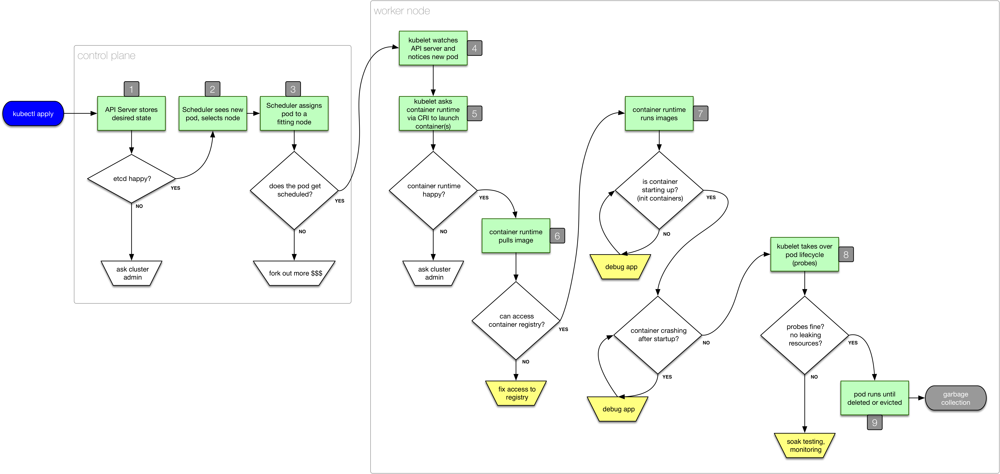

# Troubleshooting Kubernetes Applications

A talk at [Velocity NYC 2018](https://conferences.oreilly.com/velocity/vl-ny/public/schedule/detail/69892):

_When?_  &nbsp;&nbsp;&nbsp; Wednesday Oct 3, 1:30pm (40min) <br />
_Where?_ &nbsp;&nbsp; Beekman/Sutton North <br />

- [Preparation](#preparation)
- [Intro](#intro)
- [Poking Pods](#poking-pods)
- [Storage](#storage)
- [Network](#network)
- [Security](#security)
- [Observability](#observability)
- [Vaccination](#vaccination)

The slide deck is available [here](http://dev/null) and to demonstrate the different failures and how to fix them I'm using the following commands.

## Preparation

Before the talk:

```
kubectl create ns vnyc

# in different tmux pane:
watch kubectl -n vnyc get all
```

## Intro

Using [00_intro.yaml](00_intro.yaml):

```
kubectl -n vnyc apply -f 00_intro.yaml

kubectl -n vnyc describe deploy/unhappy-camper

THEPOD=$(kubectl -n vnyc get po -l=app=whatever --output=jsonpath={.items[*].metadata.name})
kubectl -n vnyc describe po/$THEPOD
kubectl -n vnyc logs $THEPOD
kubectl -n vnyc exec -it $THEPOD -- sh

kubectl -n vnyc delete deploy/unhappy-camper
```

## Poking Pods

- `kubectl get pods` and `get events`
- `kubectl exec` for when it crashes
- `kubectl logs` for app-level SNAFU



## Storage

Show failed mount

## Network

- wrong selector (can't ping VIP)
- `127.0.0.1` issue
- taking a pod offline for debugging (service)

## Security

Show missing permissions and `can-i`

## Observability

Show Linkerd 2.0 in action, Jaeger 101.

## Vaccination

Show [chaoskube](https://github.com/linki/chaoskube) in action.